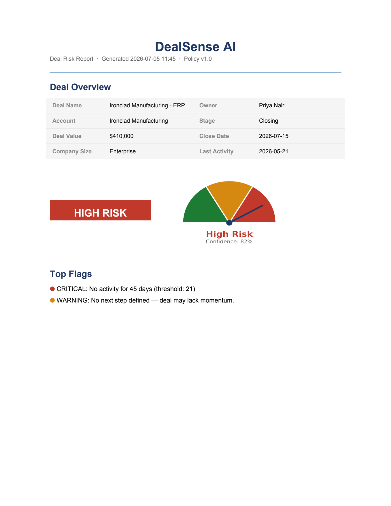
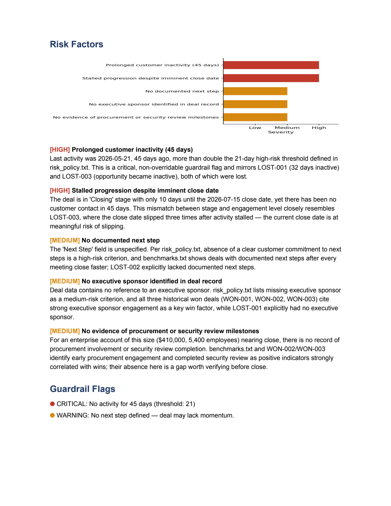
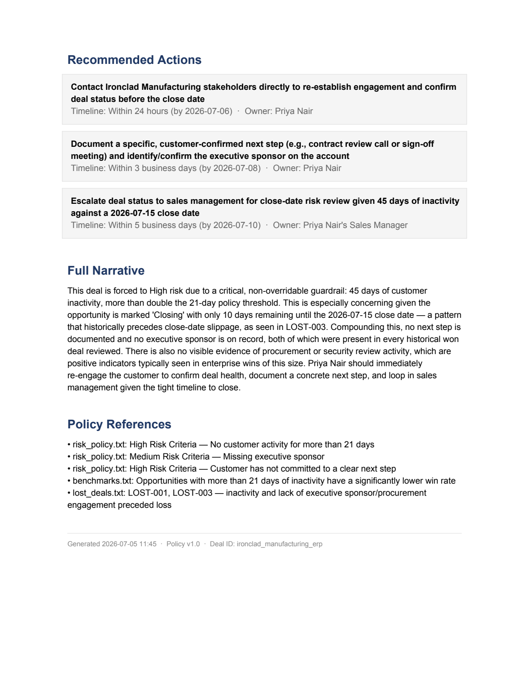

# DealSense AI

## Intelligent Deal Risk Scoring Engine

### Problem Statement

Sales managers lose deals silently — no early warning when a deal goes cold, no
consistent risk framework across reps, no systematic way to compare a live deal
against how similar deals actually played out in the past. DealSense AI addresses
this by turning any deal document into a structured, explainable risk score.

### What It Does (30-second version)

1. Watches an `inbox/` folder for freeform deal documents (PDFs — proposals, deal
   briefs, account notes — whatever a rep already writes)
2. Extracts structured deal fields from the document using Claude
3. Scores risk using a three-layer engine: policy knowledge base (RAG) + hard
   guardrails + Claude reasoning
4. Generates a 3-page PDF risk report with charts and recommended actions

### Architecture

```
inbox/*.pdf
     │
     ▼
input/extractor.py ──── Claude CLI ──▶ normalized deal dict
     │
     ▼
guardrails/engine.py (hard rules)
     │
     ▼
knowledge_base/retriever.py (RAG: policy docs, won/lost deal history)
     │
     ▼
scoring/scorer.py ──── Claude CLI ──▶ validated JSON risk score
     │
     ▼
reports/pdf_generator.py ──▶ outputs/*.pdf
     │
     ▼
reports/email_sender.py (stub — logs intended recipient/CC/subject)
```

### Three-Layer Scoring Engine

**Layer 1 — Knowledge Base (RAG)**
Before scoring any deal, the engine retrieves the most relevant chunks from four
policy documents — risk scoring criteria, historical won-deal patterns, historical
lost-deal post-mortems, and sales benchmarks — so Claude reasons from the
organization's actual policies and history, not general knowledge.

**Layer 2 — Guardrails**
Hard business rules that Claude cannot override. If a deal has had zero activity
for more than 21 days, or has sat in one stage for more than 45 days, or its close
date has already passed, the score is forced to High regardless of what the AI
concludes. Deals over $500k are automatically flagged for human review.

**Layer 3 — Claude Reasoning**
Claude synthesizes the deal data, guardrail output, and retrieved policy context
into a structured JSON verdict: score, confidence, five specific risk factors,
three recommended actions with owners and timelines, and a narrative summary.

### Key Product Decisions & Why

- **Why RAG over fine-tuning:** Policies change. A RAG layer lets scoring stay
  current by editing a document, not retraining a model — and every score can be
  traced back to a specific policy source, which matters for auditability.
- **Why hard guardrails:** Enterprise teams won't trust (or act on) a system they
  see as a black box. A guardrail that always fires on "21 days of silence" is
  predictable and explainable in a way a purely AI-driven score isn't.
- **Why a freeform-PDF input instead of a CRM integration:** This version
  intentionally skips a Salesforce/CRM dependency so it can run against whatever
  document a rep already has — a proposal, a deal memo, an account brief — with
  no CRM setup required to try it. Swapping in a real CRM connector later is a
  matter of writing a new `input/` source, since guardrails/scoring/reporting
  don't know or care where the deal dict came from.
- **Why the Claude Code CLI instead of the Anthropic API:** This build uses an
  existing Claude subscription (via `claude -p`) rather than requiring a separate
  pay-per-use API key — appropriate for personal/demo-scale use. A production
  deployment processing deals at real volume should switch `claude_cli/client.py`
  to call the Anthropic API directly, since the CLI isn't intended for backend
  service traffic.
- **Why confidence score:** A High Risk score at 40% confidence should be treated
  very differently from High Risk at 90% confidence — one warrants a check-in,
  the other an emergency call.

### Metrics I'd Track in Production

- Prediction accuracy (did "High Risk" deals actually go cold at 90 days?)
- False positive rate (High Risk deals that closed anyway)
- Time from report to action (how fast a rep responds to a High Risk report)
- Deal recovery rate (High Risk deals saved after intervention)

### What I'd Build Next (Roadmap)

- v1.1: Wire up real email delivery (SMTP/SendGrid) — `reports/email_sender.py`
  is already structured as a single drop-in function
- v1.2: Optional CRM connector (Salesforce/HubSpot) as an alternate `input/` source
- v1.3: Historical accuracy tracking + guardrail threshold calibration
- v2.0: Email-inbox ingestion (IMAP) as a second input channel alongside the
  watched folder

### Setup

```bash
python -m venv .venv
source .venv/bin/activate
pip install -r requirements.txt

# Install the Claude Code CLI and log in with your Claude subscription
npm install -g @anthropic-ai/claude-code
claude   # follow the browser login prompt once

cp .env.example .env   # defaults work out of the box, no API keys needed

# Try it with the bundled sample deals
cp sample_data/deals/*.pdf inbox/
python main.py   # ingest=True on first run to build the knowledge base
```

Generated reports land in `outputs/`; processed source PDFs move to `processed/`.

### Sample Data

`sample_data/deals/` contains 10 fictional deal briefs covering every guardrail
scenario (stalled deals, cold deals, healthy active deals, a $500k+ escalation)
so the full pipeline can be exercised without any real customer data.

### Sample Output

Report generated for `sample_data/deals/ironclad_manufacturing_erp.pdf` — a
deal that stalled with no follow-up after the buying committee asked for
"more time," correctly forced to High Risk by the guardrail engine:

| Page 1 — Executive Summary | Page 2 — Risk Analysis | Page 3 — Action Plan |
|---|---|---|
|  |  |  |
